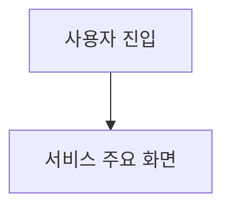
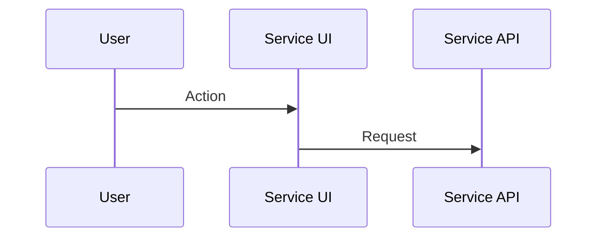
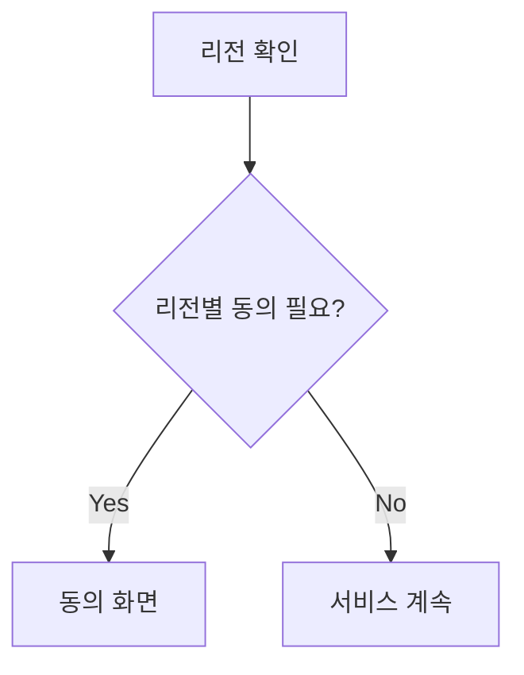
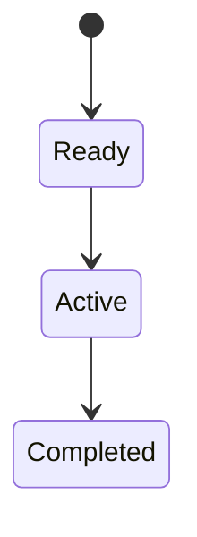
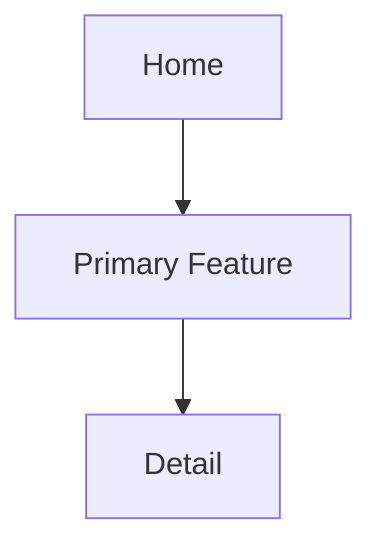
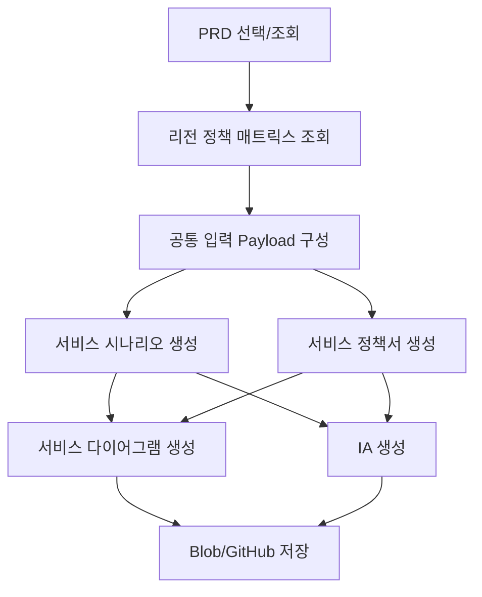

# n8n 산출물 생성 프롬프트 가이드 v1.0

## 1. 문서 목적

이 문서는 생성된 PRD를 기준으로 n8n 워크플로우에서 다음 4개 기획 산출물을 자동 생성하기 위한 프롬프트 가이드입니다.

1. 서비스 시나리오
2. 서비스 정책서
3. 서비스 다이어그램
4. IA(Information Architecture)

각 프롬프트는 글로벌 서비스 적용을 전제로 하며, 국가/리전별 법령과 정책 조건을 입력값으로 받아 산출물에 반영할 수 있어야 합니다. 법령이 확정되지 않은 경우 임의로 확정하지 않고 "확인 필요"로 표기합니다.

## 2. 공통 운영 원칙

### 2.1 입력 원칙

n8n은 각 산출물 생성 노드에 아래 입력값을 전달합니다.

| 입력 키 | 필수 | 설명 |
| --- | --- | --- |
| `prdMarkdown` | Y | 기준 PRD 전문 |
| `targetOutputType` | Y | `service_scenario`, `service_policy`, `service_diagram`, `ia` 중 하나 |
| `serviceType` | Y | 예: 글로벌 B2C 웹/앱, B2B SaaS, 게임 프로모션 |
| `targetRegions` | Y | 적용 리전 목록. 예: `KR`, `US-CA`, `EU`, `UK`, `JP` |
| `supportedLanguages` | Y | 지원 언어 목록. 예: `ko`, `en`, `ja` |
| `regionPolicyMatrix` | Y | 리전별 법령, 심의, 개인정보, 쿠키, 위치정보, 접근성, 결제/광고 규정 |
| `businessPolicyOverrides` | N | 운영자가 별도로 지정한 정책. 예: 쿠폰 중복 발급 금지 |
| `outputLanguage` | Y | 산출물 작성 언어. 기본값은 PRD 언어 |
| `documentVersion` | N | 산출물 버전 |
| `generatedDate` | N | 산출일 |

### 2.2 리전별 법령 입력 예시

```json
{
  "targetRegions": ["KR", "US-CA", "EU", "UK", "JP"],
  "regionPolicyMatrix": [
    {
      "region": "KR",
      "privacyLaws": ["개인정보 보호법", "위치정보법", "정보통신망법"],
      "cookieConsent": "비필수 쿠키 및 행태정보 수집 시 고지/동의 필요",
      "marketingConsent": "광고성 정보 수신은 별도 동의 필요",
      "agePolicy": "만 14세 미만 아동 개인정보 처리 시 법정대리인 동의 검토",
      "accessibility": "모바일/웹 접근성 품질 기준 검토",
      "notes": "게임/이벤트 프로모션의 경우 확률형 아이템, 경품 고지 여부 확인 필요"
    },
    {
      "region": "US-CA",
      "privacyLaws": ["CCPA", "CPRA", "COPPA"],
      "cookieConsent": "개인정보 판매/공유 옵트아웃 제공 필요",
      "marketingConsent": "이메일/SMS 마케팅 수신 동의 및 해지 경로 제공",
      "agePolicy": "만 13세 미만 대상 서비스는 COPPA 검토",
      "accessibility": "ADA 및 WCAG 2.1 AA 검토",
      "notes": "Do Not Sell or Share My Personal Information 링크 필요 여부 확인"
    },
    {
      "region": "EU",
      "privacyLaws": ["GDPR", "ePrivacy Directive", "DSA"],
      "cookieConsent": "비필수 쿠키는 사전 opt-in 동의 필요",
      "marketingConsent": "직접 마케팅 수신 동의 및 철회권 제공",
      "agePolicy": "아동 동의 연령은 회원국별 상이하므로 국가별 확인 필요",
      "accessibility": "European Accessibility Act 및 EN 301 549 검토",
      "notes": "개인정보 처리 목적, 보관 기간, 국외 이전 고지 필요"
    },
    {
      "region": "UK",
      "privacyLaws": ["UK GDPR", "Data Protection Act", "PECR"],
      "cookieConsent": "비필수 쿠키는 사전 opt-in 동의 필요",
      "marketingConsent": "PECR 기준 전자 마케팅 동의/철회 제공",
      "agePolicy": "Age Appropriate Design Code 검토",
      "accessibility": "Equality Act 및 WCAG 2.1 AA 검토",
      "notes": "UK와 EU 정책 문구를 분리 관리할지 확인 필요"
    },
    {
      "region": "JP",
      "privacyLaws": ["APPI"],
      "cookieConsent": "개인관련정보 제공 및 외부 전송 고지 필요 여부 확인",
      "marketingConsent": "특정전자메일법 기준 광고성 메일 수신 동의/표기 검토",
      "agePolicy": "미성년자 동의 기준 확인 필요",
      "accessibility": "JIS X 8341-3 및 WCAG 2.1 AA 검토",
      "notes": "경품 표시법, 자금결제법 적용 여부 확인 필요"
    }
  ]
}
```

### 2.3 공통 출력 규칙

* 반드시 Markdown 형식으로 작성합니다.
* 코드블록으로 전체 산출물을 감싸지 않습니다.
* 산출물 본문만 출력합니다.
* 입력 PRD와 리전 정책에 없는 정보는 임의로 확정하지 않습니다.
* 불명확한 항목은 "확인 필요"로 표기하고 마지막에 Open Questions로 정리합니다.
* 모든 ID는 산출물 약어 + 3자리 숫자 형식을 사용합니다.
* 리전별 법령/정책이 화면, 기능, 데이터, 운영 정책에 영향을 주는 경우 별도 표로 명시합니다.
* 법무 검토가 필요한 내용은 "법무 검토 필요"로 표시합니다.
* 작성 언어는 `outputLanguage`를 따릅니다.

## 3. 공통 시스템 프롬프트

아래 프롬프트는 4개 산출물 생성 노드에서 공통으로 사용합니다.

```text
당신은 글로벌 디지털 서비스의 시니어 서비스 기획자, 프로덕트 매니저, UX 아키텍트, 컴플라이언스 기획자입니다.

입력으로 제공되는 PRD와 리전별 법령/정책 매트릭스를 분석하여 요청된 산출물을 작성하세요.

반드시 지켜야 할 원칙:
- PRD에 없는 정보를 임의로 확정하지 않습니다.
- 리전별 법령과 정책이 기능, 화면, 데이터 수집, 동의, 알림, 마케팅, 접근성, 보관 기간, 삭제 요청, 쿠키/분석 이벤트에 미치는 영향을 산출물에 반영합니다.
- 리전별 법령이 확정되지 않았거나 담당 검토가 필요한 경우 "확인 필요" 또는 "법무 검토 필요"로 표시합니다.
- 글로벌 공통 정책과 리전별 예외 정책을 분리해서 작성합니다.
- 개발, 디자인, QA, 법무, 현지화 담당자가 바로 후속 작업에 사용할 수 있는 수준으로 구체화합니다.
- 산출물은 Markdown 본문만 출력합니다.
```

## 4. 프롬프트 1: 서비스 시나리오

### 4.1 목적

PRD를 기준으로 주요 사용자, 리전, 언어, 법령 조건에 따른 서비스 이용 시나리오를 정의합니다. 디자인/개발/QA가 사용자 흐름과 예외 상황을 이해할 수 있도록 정상 흐름, 대체 흐름, 실패 흐름, 리전별 분기 조건을 포함합니다.

### 4.2 n8n 입력

| 입력 키 | 설명 |
| --- | --- |
| `prdMarkdown` | 기준 PRD |
| `targetRegions` | 시나리오 적용 리전 |
| `supportedLanguages` | 시나리오 작성 시 고려할 언어 |
| `regionPolicyMatrix` | 리전별 개인정보, 위치정보, 쿠키, 마케팅, 연령, 접근성 정책 |
| `businessPolicyOverrides` | 별도 운영 정책 |

### 4.3 사용자 프롬프트

```text
아래 [PRD]와 [리전별 법령/정책 매트릭스]를 기준으로 서비스 시나리오 문서를 작성하세요.

목표:
- 핵심 사용자별 End-to-End 서비스 이용 시나리오를 작성합니다.
- 글로벌 공통 흐름과 리전별 분기 흐름을 구분합니다.
- 법령/정책 때문에 달라지는 동의, 고지, 데이터 수집, 마케팅, 쿠키, 위치정보, 연령 확인, 접근성 조건을 시나리오에 반영합니다.
- 정상 흐름뿐 아니라 대체 흐름, 실패 흐름, 예외 흐름을 포함합니다.
- 화면, 기능 요구사항, 이벤트 트래킹, Acceptance Criteria와 연결될 수 있도록 작성합니다.

출력 구조:
## 1. 문서 개요
- 산출물명
- 기준 PRD
- 대상 서비스
- 대상 리전
- 지원 언어
- 문서 버전
- 작성일

## 2. 시나리오 요약
| ID | 시나리오명 | 주요 Persona | 대상 리전 | 관련 FR | 우선순위 |

## 3. Persona 및 컨텍스트
| Persona ID | 사용자 유형 | 리전 | 언어 | 목표 | 주요 제약/법령 고려사항 |

## 4. 글로벌 공통 시나리오
### SCN-001. 시나리오명
| Step | Screen/Touchpoint | User Action | System Action | Data Used | Consent/Policy Check | Next |

## 5. 리전별 분기 시나리오
| Region | Trigger | Required Notice/Consent | Scenario Change | Related Law/Policy | Owner |

## 6. 대체/예외 시나리오
| ID | Scenario | Trigger | System Fallback | User Message | Region | Related FR/AC |

## 7. 데이터 및 이벤트 트래킹 시나리오
| Event ID | Event Name | Trigger | Required Properties | Region Restriction | Consent Required | Analytics Tool |

## 8. 접근성 및 현지화 고려사항
| 항목 | 공통 기준 | 리전/언어별 고려사항 | 확인 필요 여부 |

## 9. QA 검증 포인트
| ID | Given | When | Then | Region | Priority |

## 10. Open Questions
| ID | Question | Context | Region | Assignee | Status |

[PRD]
{{prdMarkdown}}

[리전별 법령/정책 매트릭스]
{{regionPolicyMatrix}}

[운영 정책 Override]
{{businessPolicyOverrides}}
```

## 5. 프롬프트 2: 서비스 정책서

### 5.1 목적

PRD의 기능 요구사항, 비즈니스 규칙, 법무/컴플라이언스 요구사항을 기준으로 운영 가능한 정책 문서를 생성합니다. 글로벌 공통 정책과 리전별 예외 정책을 분리하고, 서비스/운영/개발/QA가 참조할 수 있는 기준을 만듭니다.

### 5.2 n8n 입력

| 입력 키 | 설명 |
| --- | --- |
| `prdMarkdown` | 기준 PRD |
| `targetRegions` | 정책 적용 리전 |
| `regionPolicyMatrix` | 리전별 법령/정책 |
| `businessPolicyOverrides` | 운영자가 지정한 정책 |
| `supportedLanguages` | 약관/문구/고지 언어 |

### 5.3 사용자 프롬프트

```text
아래 [PRD]와 [리전별 법령/정책 매트릭스]를 기준으로 서비스 정책서를 작성하세요.

목표:
- 서비스 운영에 필요한 정책을 글로벌 공통 정책과 리전별 예외 정책으로 분리합니다.
- 개인정보, 위치정보, 쿠키/분석, 마케팅 수신, 연령, 쿠폰/이벤트, 콘텐츠, 접근성, 데이터 보관/삭제, 장애 대응 정책을 포함합니다.
- 정책별 적용 범위, 관련 기능, 사용자 고지 문구 필요 여부, 개발 구현 필요 항목, QA 검증 기준을 명시합니다.
- 법령 해석이 필요한 항목은 확정하지 말고 "법무 검토 필요"로 표시합니다.

출력 구조:
## 1. 문서 개요
- 산출물명
- 기준 PRD
- 대상 서비스
- 대상 리전
- 문서 버전
- 작성일

## 2. 정책 요약
| Policy ID | 정책명 | 적용 범위 | 관련 FR | 리전 영향 | 우선순위 |

## 3. 글로벌 공통 정책
| Policy ID | 정책 영역 | 정책 내용 | 사용자 고지 | 구현 필요 항목 | QA 기준 |

## 4. 리전별 법령/정책 적용표
| Region | Law/Policy | 적용 대상 | 서비스 반영 방식 | 필수 고지/동의 | 법무 검토 |

## 5. 개인정보 및 데이터 처리 정책
| Policy ID | Data Category | Purpose | Collection Timing | Retention | Deletion Request | Region Restriction |

## 6. 위치정보 정책
| Policy ID | Trigger | Consent Required | Fallback | User Message | Region |

## 7. 쿠키/분석/마케팅 정책
| Policy ID | Tracking Type | Consent Model | Opt-out Method | Region | Related Event |

## 8. 쿠폰/이벤트/프로모션 정책
| Policy ID | Rule | Eligibility | Limit | Expiration | Abuse Prevention | Related FR |

## 9. 연령 및 미성년자 정책
| Region | Age Threshold | Required Action | Guardian Consent | Service Restriction | Open Question |

## 10. 접근성 및 현지화 정책
| Policy ID | Area | Standard | Region/Language | Required Implementation |

## 11. 장애/예외/CS 정책
| Policy ID | Scenario | User Notice | Operational Action | SLA | Escalation Owner |

## 12. QA 체크리스트
| ID | Policy ID | Check Item | Region | Expected Result |

## 13. Open Questions
| ID | Question | Context | Region | Assignee | Status |

[PRD]
{{prdMarkdown}}

[리전별 법령/정책 매트릭스]
{{regionPolicyMatrix}}

[운영 정책 Override]
{{businessPolicyOverrides}}
```

## 6. 프롬프트 3: 서비스 다이어그램

### 6.1 목적

PRD와 정책 조건을 기준으로 서비스 흐름, 시스템 연동, 데이터 처리, 리전별 정책 분기를 시각화할 수 있는 Mermaid 다이어그램 문서를 생성합니다.

### 6.2 n8n 입력

| 입력 키 | 설명 |
| --- | --- |
| `prdMarkdown` | 기준 PRD |
| `targetRegions` | 다이어그램에 표시할 리전 |
| `regionPolicyMatrix` | 리전별 법령/정책 |
| `diagramTypes` | 필요한 다이어그램 유형. 예: flowchart, sequence, state, data_flow |

### 6.3 사용자 프롬프트

````text
아래 [PRD]와 [리전별 법령/정책 매트릭스]를 기준으로 서비스 다이어그램 문서를 작성하세요.

목표:
- 서비스 사용자 흐름, 시스템 연동 흐름, 데이터 처리 흐름, 정책 분기 흐름을 Mermaid 문법으로 작성합니다.
- 각 다이어그램 앞에는 목적과 읽는 방법을 간단히 설명합니다.
- 리전별 법령/정책이 동의, 데이터 수집, 분석 이벤트, 위치정보, 마케팅 수신에 영향을 주는 지점을 다이어그램에 표시합니다.
- Mermaid 문법 오류가 나지 않도록 노드명은 짧고 명확하게 작성합니다.
- 복잡한 설명은 다이어그램 밖의 표로 보완합니다.

출력 구조:
## 1. 문서 개요
- 산출물명
- 기준 PRD
- 대상 리전
- 다이어그램 유형
- 문서 버전

## 2. 전체 서비스 흐름 다이어그램


## 3. 사용자 시나리오 시퀀스 다이어그램


## 4. 정책 분기 다이어그램


## 5. 데이터 처리 흐름 다이어그램


## 6. 상태 전이 다이어그램


## 7. 다이어그램 요소 정의
| Element ID | Name | Type | Description | Related FR | Region/Policy |

## 8. 리전별 정책 영향 요약
| Region | Policy Trigger | Diagram Section | Required Branch | Open Question |

## 9. Open Questions
| ID | Question | Context | Region | Assignee | Status |

[PRD]
{{prdMarkdown}}

[리전별 법령/정책 매트릭스]
{{regionPolicyMatrix}}

[필요 다이어그램 유형]
{{diagramTypes}}
````

## 7. 프롬프트 4: IA

### 7.1 목적

PRD, 서비스 시나리오, 정책 조건을 기준으로 화면 구조, 내비게이션, 콘텐츠 계층, 리전/언어/법령에 따른 노출 조건을 정의합니다.

### 7.2 n8n 입력

| 입력 키 | 설명 |
| --- | --- |
| `prdMarkdown` | 기준 PRD |
| `serviceScenarioMarkdown` | 생성된 서비스 시나리오. 없으면 PRD만 기준으로 작성 |
| `servicePolicyMarkdown` | 생성된 서비스 정책서. 없으면 PRD와 리전 정책 기준으로 작성 |
| `targetRegions` | IA 적용 리전 |
| `supportedLanguages` | IA에 반영할 언어 |
| `regionPolicyMatrix` | 리전별 법령/정책 |

### 7.3 사용자 프롬프트

````text
아래 [PRD], [서비스 시나리오], [서비스 정책서], [리전별 법령/정책 매트릭스]를 기준으로 IA 문서를 작성하세요.

목표:
- 사용자 목적과 기능 요구사항을 기준으로 화면/메뉴/콘텐츠 구조를 정의합니다.
- 글로벌 공통 IA와 리전별 조건부 IA를 분리합니다.
- 법령/정책에 따라 필요한 동의 화면, 고지 화면, 개인정보 설정, 쿠키 설정, 마케팅 수신 설정, 위치 권한 대체 화면을 IA에 포함합니다.
- 각 화면의 목적, 진입 경로, 주요 콘텐츠, 주요 액션, 데이터/권한 조건, 다국어 적용 여부를 명시합니다.
- 디자인/Lo-Fi/화면 목록 생성의 입력으로 사용할 수 있도록 화면 단위를 구체화합니다.

출력 구조:
## 1. 문서 개요
- 산출물명
- 기준 PRD
- 대상 리전
- 지원 언어
- 문서 버전

## 2. IA 요약
| IA ID | 영역 | 목적 | 주요 사용자 | 관련 시나리오 | 우선순위 |

## 3. 사이트맵


## 4. 화면 목록
| Screen ID | 화면명 | Depth | Parent | Purpose | Key Actions | Related FR | Region Condition | i18n |

## 5. 글로벌 공통 내비게이션 구조
| Nav ID | Label | Destination | Visibility | Priority | Notes |

## 6. 리전별 조건부 화면/메뉴
| Region | Screen/Menu | Trigger | Required by Law/Policy | Visibility Rule | Fallback |

## 7. 화면별 콘텐츠 구조
### SCR-001. 화면명
| Section ID | Section Name | Content | CTA | Data Source | Policy/Consent Dependency |

## 8. 권한/동의/설정 IA
| Screen ID | Consent/Setting Type | Region | Entry Point | Required Action | User Control |

## 9. 현지화 IA 고려사항
| Language/Region | Text Expansion | Date/Number/Currency | Address Format | RTL | Notes |

## 10. 접근성 IA 고려사항
| Area | Requirement | IA Impact | Related Screen |

## 11. 추적 이벤트 매핑
| Event ID | Event Name | Screen | Trigger | Required Properties | Region Consent |

## 12. Open Questions
| ID | Question | Context | Region | Assignee | Status |

[PRD]
{{prdMarkdown}}

[서비스 시나리오]
{{serviceScenarioMarkdown}}

[서비스 정책서]
{{servicePolicyMarkdown}}

[리전별 법령/정책 매트릭스]
{{regionPolicyMatrix}}
````

## 8. n8n 워크플로우 권장 구성



권장 생성 순서는 다음과 같습니다.

1. 서비스 시나리오
2. 서비스 정책서
3. 서비스 다이어그램
4. IA

다이어그램과 IA는 서비스 시나리오/정책서 결과를 함께 입력받으면 품질이 높아집니다. 단, 1차 PoC에서는 PRD와 리전 정책 매트릭스만으로도 생성 가능하게 구성합니다.

## 9. 산출물 파일명 규칙

| 산출물 | 권장 파일명 |
| --- | --- |
| 서비스 시나리오 | `scenario/SCN_{source_prd_name}_{yyyyMMdd_HHmmss}.md` |
| 서비스 정책서 | `policy/POL_{source_prd_name}_{yyyyMMdd_HHmmss}.md` |
| 서비스 다이어그램 | `diagram/DGM_{source_prd_name}_{yyyyMMdd_HHmmss}.md` |
| IA | `ia/IA_{source_prd_name}_{yyyyMMdd_HHmmss}.md` |

## 10. 검수 체크리스트

| ID | Check Item | Pass 기준 |
| --- | --- | --- |
| QC-001 | PRD 기반성 | PRD의 주요 목표, FR, 정책, 화면이 산출물에 반영됨 |
| QC-002 | 리전 정책 반영 | `targetRegions`별 법령/정책 영향이 표 또는 분기 흐름으로 표시됨 |
| QC-003 | 임의 확정 방지 | 입력에 없는 수치, 법령 해석, 담당자, 일정이 임의로 확정되지 않음 |
| QC-004 | Open Questions | 불명확한 법무/정책/기능/데이터 항목이 Open Questions에 정리됨 |
| QC-005 | 후속 산출물 연계성 | 시나리오, 정책서, 다이어그램, IA 간 ID/화면/FR 참조가 가능함 |
| QC-006 | 글로벌 서비스 적합성 | 언어, 로케일, 접근성, 쿠키/분석, 개인정보, 위치정보 조건이 포함됨 |
