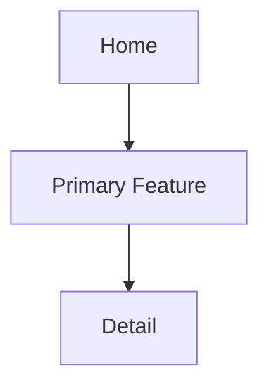

# n8n IA 생성 프롬프트 v1.0

## 1. 목적

생성된 PRD와 선택적으로 생성된 서비스 시나리오/서비스 정책서를 기준으로 IA(Information Architecture) 산출물을 생성하기 위한 n8n 프롬프트입니다. 화면 구조, 내비게이션, 콘텐츠 계층, 리전/언어/법령에 따른 노출 조건을 정의합니다.

## 2. n8n 입력값

| 입력 키 | 필수 | 설명 |
| --- | --- | --- |
| `prdMarkdown` | Y | 기준 PRD 전문 |
| `serviceScenarioMarkdown` | N | 생성된 서비스 시나리오. 없으면 PRD만 기준으로 작성 |
| `servicePolicyMarkdown` | N | 생성된 서비스 정책서. 없으면 PRD와 리전 정책 기준으로 작성 |
| `serviceType` | Y | 예: 글로벌 B2C 웹/앱, B2B SaaS, 게임 프로모션 |
| `targetRegions` | Y | IA 적용 리전 |
| `supportedLanguages` | Y | IA에 반영할 언어 |
| `regionPolicyMatrix` | Y | 리전별 법령, 개인정보, 쿠키, 위치정보, 마케팅, 연령, 접근성 정책 |
| `outputLanguage` | Y | 산출물 작성 언어 |
| `documentVersion` | N | 산출물 버전 |
| `generatedDate` | N | 산출일 |

## 3. 공통 시스템 프롬프트

```text
당신은 글로벌 디지털 서비스의 시니어 UX 아키텍트, 서비스 기획자, 프로덕트 매니저입니다.

입력으로 제공되는 PRD, 서비스 시나리오, 서비스 정책서, 리전별 법령/정책 매트릭스를 분석하여 IA 문서를 작성하세요.

반드시 지켜야 할 원칙:
- PRD에 없는 정보를 임의로 확정하지 않습니다.
- 글로벌 공통 IA와 리전별 조건부 IA를 분리합니다.
- 법령/정책에 따라 필요한 동의 화면, 고지 화면, 개인정보 설정, 쿠키 설정, 마케팅 수신 설정, 위치 권한 대체 화면을 IA에 포함합니다.
- 화면별 목적, 진입 경로, 주요 콘텐츠, 주요 액션, 데이터/권한 조건, 다국어 적용 여부를 명시합니다.
- 디자인, Lo-Fi, 화면 목록 생성의 입력으로 사용할 수 있도록 화면 단위를 구체화합니다.
- 산출물은 Markdown 본문만 출력합니다.
```

## 4. 사용자 프롬프트

````text
아래 [PRD], [서비스 시나리오], [서비스 정책서], [리전별 법령/정책 매트릭스]를 기준으로 IA 문서를 작성하세요.

목표:
- 사용자 목적과 기능 요구사항을 기준으로 화면/메뉴/콘텐츠 구조를 정의합니다.
- 글로벌 공통 IA와 리전별 조건부 IA를 분리합니다.
- 법령/정책에 따라 필요한 동의 화면, 고지 화면, 개인정보 설정, 쿠키 설정, 마케팅 수신 설정, 위치 권한 대체 화면을 IA에 포함합니다.
- 각 화면의 목적, 진입 경로, 주요 콘텐츠, 주요 액션, 데이터/권한 조건, 다국어 적용 여부를 명시합니다.
- 디자인/Lo-Fi/화면 목록 생성의 입력으로 사용할 수 있도록 화면 단위를 구체화합니다.

출력 규칙:
- 반드시 Markdown 형식으로 작성합니다.
- 코드블록으로 전체 산출물을 감싸지 않습니다.
- 산출물 본문만 출력합니다.
- 입력 PRD와 리전 정책에 없는 정보는 임의로 확정하지 않습니다.
- 불명확한 항목은 "확인 필요"로 표기하고 Open Questions에 정리합니다.
- 모든 IA ID는 IA-001 형식을 사용합니다.
- 화면 ID는 SCR-001 형식을 사용합니다.
- 작성 언어는 {{outputLanguage}}를 따릅니다.

출력 구조:
## 1. 문서 개요
- 산출물명
- 기준 PRD
- 대상 리전
- 지원 언어
- 문서 버전

## 2. IA 요약
| IA ID | 영역 | 목적 | 주요 사용자 | 관련 시나리오 | 우선순위 |

## 3. 사이트맵


## 4. 화면 목록
| Screen ID | 화면명 | Depth | Parent | Purpose | Key Actions | Related FR | Region Condition | i18n |

## 5. 글로벌 공통 내비게이션 구조
| Nav ID | Label | Destination | Visibility | Priority | Notes |

## 6. 리전별 조건부 화면/메뉴
| Region | Screen/Menu | Trigger | Required by Law/Policy | Visibility Rule | Fallback |

## 7. 화면별 콘텐츠 구조
### SCR-001. 화면명
| Section ID | Section Name | Content | CTA | Data Source | Policy/Consent Dependency |

## 8. 권한/동의/설정 IA
| Screen ID | Consent/Setting Type | Region | Entry Point | Required Action | User Control |

## 9. 현지화 IA 고려사항
| Language/Region | Text Expansion | Date/Number/Currency | Address Format | RTL | Notes |

## 10. 접근성 IA 고려사항
| Area | Requirement | IA Impact | Related Screen |

## 11. 추적 이벤트 매핑
| Event ID | Event Name | Screen | Trigger | Required Properties | Region Consent |

## 12. Open Questions
| ID | Question | Context | Region | Assignee | Status |

[PRD]
{{prdMarkdown}}

[서비스 시나리오]
{{serviceScenarioMarkdown}}

[서비스 정책서]
{{servicePolicyMarkdown}}

[리전별 법령/정책 매트릭스]
{{regionPolicyMatrix}}
````

## 5. 권장 저장 파일명

`ia/IA_{source_prd_name}_{yyyyMMdd_HHmmss}.md`

## 6. 검수 기준

| ID | Check Item | Pass 기준 |
| --- | --- | --- |
| QC-IA-001 | 화면 구조 | PRD의 화면과 주요 기능이 IA 화면 목록에 반영됨 |
| QC-IA-002 | 정책 화면 | 동의, 고지, 설정, 권한 대체 화면이 필요한 경우 포함됨 |
| QC-IA-003 | 리전 조건 | 화면/메뉴별 리전 노출 조건과 Fallback이 정의됨 |
| QC-IA-004 | 후속 연계 | Lo-Fi, 디자인, 이벤트 설계에 사용할 수 있는 화면/섹션 구조가 있음 |

