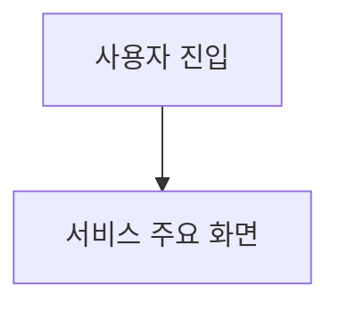
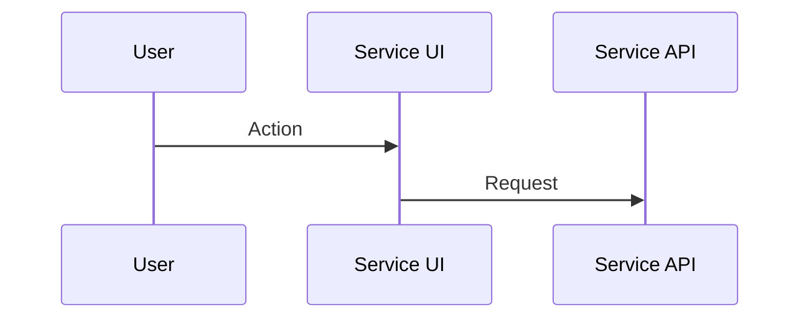
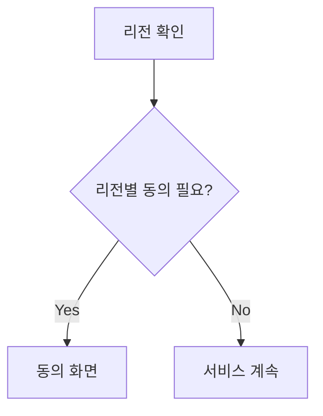
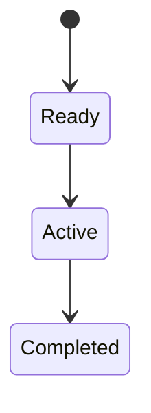

# n8n 서비스 다이어그램 생성 프롬프트 v1.0

## 1. 목적

생성된 PRD를 기준으로 글로벌 서비스 다이어그램 산출물을 생성하기 위한 n8n 프롬프트입니다. 사용자 흐름, 시스템 연동, 데이터 처리, 리전별 정책 분기, 상태 전이를 Mermaid 문법으로 작성합니다.

## 2. n8n 입력값

| 입력 키 | 필수 | 설명 |
| --- | --- | --- |
| `prdMarkdown` | Y | 기준 PRD 전문 |
| `serviceType` | Y | 예: 글로벌 B2C 웹/앱, B2B SaaS, 게임 프로모션 |
| `targetRegions` | Y | 다이어그램에 표시할 리전 |
| `supportedLanguages` | N | 지원 언어 목록 |
| `regionPolicyMatrix` | Y | 리전별 법령, 개인정보, 쿠키, 위치정보, 마케팅, 연령, 접근성 정책 |
| `diagramTypes` | N | 필요한 다이어그램 유형. 예: `flowchart`, `sequence`, `state`, `data_flow` |
| `outputLanguage` | Y | 산출물 작성 언어 |
| `documentVersion` | N | 산출물 버전 |
| `generatedDate` | N | 산출일 |

## 3. 공통 시스템 프롬프트

```text
당신은 글로벌 디지털 서비스의 시니어 서비스 기획자, 시스템 분석가, UX 아키텍트입니다.

입력으로 제공되는 PRD와 리전별 법령/정책 매트릭스를 분석하여 Mermaid 기반 서비스 다이어그램 문서를 작성하세요.

반드시 지켜야 할 원칙:
- PRD에 없는 정보를 임의로 확정하지 않습니다.
- 리전별 법령과 정책이 동의, 데이터 수집, 분석 이벤트, 위치정보, 마케팅 수신에 영향을 주는 지점을 다이어그램에 표시합니다.
- Mermaid 문법 오류가 나지 않도록 노드명은 짧고 명확하게 작성합니다.
- 복잡한 정책 설명은 다이어그램 밖의 표로 보완합니다.
- 법령/정책이 불명확한 경우 "확인 필요" 또는 "법무 검토 필요"로 표시합니다.
- 산출물은 Markdown 본문만 출력합니다.
```

## 4. 사용자 프롬프트

````text
아래 [PRD]와 [리전별 법령/정책 매트릭스]를 기준으로 서비스 다이어그램 문서를 작성하세요.

목표:
- 서비스 사용자 흐름, 시스템 연동 흐름, 데이터 처리 흐름, 정책 분기 흐름을 Mermaid 문법으로 작성합니다.
- 각 다이어그램 앞에는 목적과 읽는 방법을 간단히 설명합니다.
- 리전별 법령/정책이 동의, 데이터 수집, 분석 이벤트, 위치정보, 마케팅 수신에 영향을 주는 지점을 다이어그램에 표시합니다.
- Mermaid 문법 오류가 나지 않도록 노드명은 짧고 명확하게 작성합니다.
- 복잡한 설명은 다이어그램 밖의 표로 보완합니다.

출력 규칙:
- 반드시 Markdown 형식으로 작성합니다.
- 코드블록으로 전체 산출물을 감싸지 않습니다.
- 산출물 본문만 출력합니다.
- 입력 PRD와 리전 정책에 없는 정보는 임의로 확정하지 않습니다.
- 불명확한 항목은 "확인 필요"로 표기하고 Open Questions에 정리합니다.
- 모든 다이어그램 요소 ID는 DGM-001 형식을 사용합니다.
- 작성 언어는 {{outputLanguage}}를 따릅니다.

출력 구조:
## 1. 문서 개요
- 산출물명
- 기준 PRD
- 대상 리전
- 다이어그램 유형
- 문서 버전

## 2. 전체 서비스 흐름 다이어그램


## 3. 사용자 시나리오 시퀀스 다이어그램


## 4. 정책 분기 다이어그램


## 5. 데이터 처리 흐름 다이어그램


## 6. 상태 전이 다이어그램


## 7. 다이어그램 요소 정의
| Element ID | Name | Type | Description | Related FR | Region/Policy |

## 8. 리전별 정책 영향 요약
| Region | Policy Trigger | Diagram Section | Required Branch | Open Question |

## 9. Open Questions
| ID | Question | Context | Region | Assignee | Status |

[PRD]
{{prdMarkdown}}

[리전별 법령/정책 매트릭스]
{{regionPolicyMatrix}}

[필요 다이어그램 유형]
{{diagramTypes}}
````

## 5. 권장 저장 파일명

`diagram/DGM_{source_prd_name}_{yyyyMMdd_HHmmss}.md`

## 6. 검수 기준

| ID | Check Item | Pass 기준 |
| --- | --- | --- |
| QC-DGM-001 | Mermaid 문법 | 주요 다이어그램이 Mermaid 문법으로 작성됨 |
| QC-DGM-002 | 정책 분기 | 리전별 동의/고지/데이터 처리 분기가 시각화됨 |
| QC-DGM-003 | 시스템 흐름 | 사용자, UI, API, 외부 서비스, 저장소 흐름이 표현됨 |
| QC-DGM-004 | 설명 보완 | 다이어그램 요소와 리전별 정책 영향이 표로 보완됨 |

