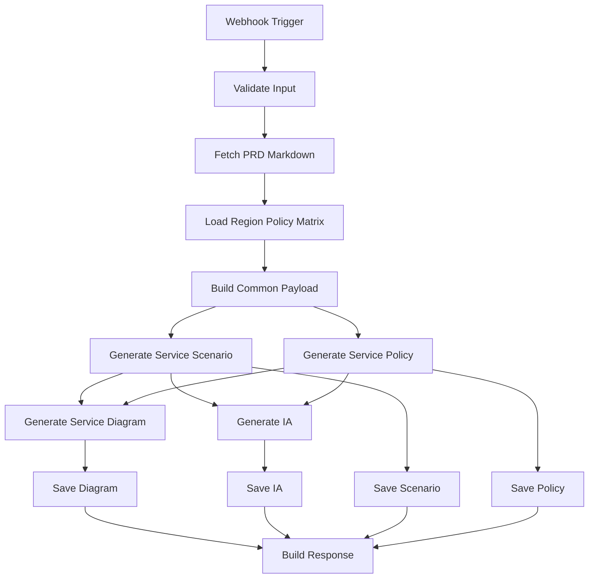

# n8n 산출물 생성 Workflow Node 구성 v1.0

## 1. 목적

생성된 PRD를 기준으로 n8n에서 다음 4개 산출물을 자동 생성하기 위한 노드 구성을 정의합니다.

1. 서비스 시나리오
2. 서비스 정책서
3. 서비스 다이어그램
4. IA

이 워크플로우는 PRD Markdown을 입력으로 받고, 리전별 법령/정책 매트릭스를 결합한 뒤, 4개 생성 노드를 실행하고 결과를 Vercel Blob 또는 GitHub 경로에 저장하는 구조입니다.

## 2. 전체 Workflow 구조



## 3. 입력 Payload 규격

### 3.1 Webhook 입력 예시

```json
{
  "sourcePrdPath": "prd/PRD_REQ_coupon_admin_20260611_20260617_184726.md",
  "sourcePrdName": "PRD_REQ_coupon_admin_20260611_20260617_184726",
  "serviceType": "global_b2c_web_promotion",
  "targetRegions": ["KR", "US-CA", "EU", "UK", "JP"],
  "supportedLanguages": ["ko", "en", "ja"],
  "outputLanguage": "ko",
  "documentVersion": "1.0",
  "businessPolicyOverrides": {
    "promotionAbusePrevention": "중복 참여, 자동화 트래픽, 비정상 공유 이벤트는 제한한다.",
    "analyticsPolicy": "분석 이벤트는 리전별 동의 상태를 확인한 뒤 수집한다."
  },
  "saveTargets": {
    "blob": true,
    "github": false
  }
}
```

### 3.2 필수 입력값

| Key | 필수 | 설명 |
| --- | --- | --- |
| `sourcePrdPath` | Y | Blob 또는 GitHub에서 읽을 PRD 경로 |
| `sourcePrdName` | N | 저장 파일명에 사용할 PRD 이름. 없으면 `sourcePrdPath`에서 추출 |
| `serviceType` | Y | 서비스 유형 |
| `targetRegions` | Y | 산출물에 적용할 리전 |
| `supportedLanguages` | Y | 지원 언어 |
| `outputLanguage` | Y | 산출물 작성 언어 |
| `documentVersion` | N | 산출물 버전 |
| `businessPolicyOverrides` | N | 운영 정책 override |
| `saveTargets` | N | 저장 대상 설정 |

## 4. Node 상세 구성

## 4.1 Node 01. Webhook Trigger

| 항목 | 값 |
| --- | --- |
| Node Type | Webhook |
| Method | POST |
| Path | `agent2-output-generate` |
| Response Mode | Respond to Webhook Node 사용 권장 |
| 목적 | PRD 기반 4개 산출물 생성 요청 수신 |

출력:

```json
{
  "body": {
    "sourcePrdPath": "...",
    "targetRegions": ["KR", "US-CA", "EU"]
  }
}
```

## 4.2 Node 02. Validate Input

| 항목 | 값 |
| --- | --- |
| Node Type | Code |
| 목적 | 필수 입력값 검증 및 기본값 설정 |

Code 예시:

```javascript
const body = $json.body || $json;

const required = ['sourcePrdPath', 'serviceType', 'targetRegions', 'supportedLanguages', 'outputLanguage'];
const missing = required.filter((key) => body[key] === undefined || body[key] === null || body[key] === '');

if (missing.length) {
  throw new Error(`Missing required fields: ${missing.join(', ')}`);
}

const sourcePrdName = body.sourcePrdName || String(body.sourcePrdPath).split('/').pop().replace(/\.md$/i, '');
const now = new Date();
const timestamp = now.toISOString().replace(/[-:]/g, '').replace(/\.\d{3}Z$/, '');

return [
  {
    json: {
      ...body,
      sourcePrdName,
      generatedDate: body.generatedDate || now.toISOString().slice(0, 10),
      timestamp,
      documentVersion: body.documentVersion || '1.0',
      saveTargets: {
        blob: body.saveTargets?.blob !== false,
        github: body.saveTargets?.github === true
      }
    }
  }
];
```

## 4.3 Node 03. Fetch PRD Markdown

| 항목 | 값 |
| --- | --- |
| Node Type | HTTP Request |
| Method | GET |
| URL | `{{$env.APP_BASE_URL}}/api/blob-file?path={{encodeURIComponent($json.sourcePrdPath)}}` |
| 목적 | Vercel Blob에 저장된 PRD Markdown 조회 |

응답에서 사용할 값:

| 값 | 설명 |
| --- | --- |
| `content` 또는 `text` | PRD Markdown 전문 |
| `path` | PRD 경로 |

대체 경로:

GitHub에서 읽어야 하는 경우 URL을 아래로 바꿉니다.

```text
{{$env.APP_BASE_URL}}/api/github-file?path={{encodeURIComponent($json.sourcePrdPath)}}
```

## 4.4 Node 04. Load Region Policy Matrix

| 항목 | 값 |
| --- | --- |
| Node Type | Code |
| 목적 | targetRegions 기준 리전별 법령/정책 매트릭스 생성 |

Code 예시:

```javascript
const input = $('Validate Input').first().json;
const prdResult = $('Fetch PRD Markdown').first().json;

const policyMaster = {
  KR: {
    region: 'KR',
    privacyLaws: ['개인정보 보호법', '위치정보법', '정보통신망법'],
    cookieConsent: '비필수 쿠키 및 행태정보 수집 시 고지/동의 필요',
    marketingConsent: '광고성 정보 수신은 별도 동의 필요',
    agePolicy: '만 14세 미만 아동 개인정보 처리 시 법정대리인 동의 검토',
    accessibility: '모바일/웹 접근성 품질 기준 검토',
    notes: '게임/이벤트 프로모션은 경품, 확률형 아이템, 청소년 보호 기준 확인 필요'
  },
  'US-CA': {
    region: 'US-CA',
    privacyLaws: ['CCPA', 'CPRA', 'COPPA'],
    cookieConsent: '개인정보 판매/공유 옵트아웃 제공 필요',
    marketingConsent: '이메일/SMS 마케팅 수신 동의 및 해지 경로 제공',
    agePolicy: '만 13세 미만 대상 서비스는 COPPA 검토',
    accessibility: 'ADA 및 WCAG 2.1 AA 검토',
    notes: 'Do Not Sell or Share My Personal Information 링크 필요 여부 확인'
  },
  EU: {
    region: 'EU',
    privacyLaws: ['GDPR', 'ePrivacy Directive', 'DSA'],
    cookieConsent: '비필수 쿠키는 사전 opt-in 동의 필요',
    marketingConsent: '직접 마케팅 수신 동의 및 철회권 제공',
    agePolicy: '아동 동의 연령은 회원국별 상이하므로 국가별 확인 필요',
    accessibility: 'European Accessibility Act 및 EN 301 549 검토',
    notes: '개인정보 처리 목적, 보관 기간, 국외 이전 고지 필요'
  },
  UK: {
    region: 'UK',
    privacyLaws: ['UK GDPR', 'Data Protection Act', 'PECR'],
    cookieConsent: '비필수 쿠키는 사전 opt-in 동의 필요',
    marketingConsent: 'PECR 기준 전자 마케팅 동의/철회 제공',
    agePolicy: 'Age Appropriate Design Code 검토',
    accessibility: 'Equality Act 및 WCAG 2.1 AA 검토',
    notes: 'UK와 EU 정책 문구 분리 관리 여부 확인 필요'
  },
  JP: {
    region: 'JP',
    privacyLaws: ['APPI'],
    cookieConsent: '개인관련정보 제공 및 외부 전송 고지 필요 여부 확인',
    marketingConsent: '특정전자메일법 기준 광고성 메일 수신 동의/표기 검토',
    agePolicy: '미성년자 동의 기준 확인 필요',
    accessibility: 'JIS X 8341-3 및 WCAG 2.1 AA 검토',
    notes: '경품 표시법, 자금결제법 적용 여부 확인 필요'
  }
};

const regionPolicyMatrix = input.targetRegions.map((region) => {
  return policyMaster[region] || {
    region,
    privacyLaws: ['확인 필요'],
    cookieConsent: '확인 필요',
    marketingConsent: '확인 필요',
    agePolicy: '확인 필요',
    accessibility: 'WCAG 2.1 AA 검토',
    notes: '리전별 법령/정책 매트릭스 추가 필요'
  };
});

return [
  {
    json: {
      ...input,
      prdMarkdown: prdResult.content || prdResult.text || prdResult,
      regionPolicyMatrix
    }
  }
];
```

운영 고도화 시 `policyMaster`는 Code 노드에 하드코딩하지 말고 Google Sheets, Notion DB, GitHub JSON, Blob JSON 중 하나로 분리하는 것을 권장합니다.

## 4.5 Node 05. Build Common Payload

| 항목 | 값 |
| --- | --- |
| Node Type | Set 또는 Code |
| 목적 | 4개 생성 노드가 공통으로 사용할 Payload 구성 |

Code 예시:

```javascript
const item = $json;

return [
  {
    json: {
      prdMarkdown: item.prdMarkdown,
      serviceType: item.serviceType,
      targetRegions: item.targetRegions,
      supportedLanguages: item.supportedLanguages,
      regionPolicyMatrix: item.regionPolicyMatrix,
      businessPolicyOverrides: item.businessPolicyOverrides || {},
      outputLanguage: item.outputLanguage,
      documentVersion: item.documentVersion,
      generatedDate: item.generatedDate,
      timestamp: item.timestamp,
      sourcePrdPath: item.sourcePrdPath,
      sourcePrdName: item.sourcePrdName,
      saveTargets: item.saveTargets
    }
  }
];
```

## 4.6 Node 06. Generate Service Scenario

| 항목 | 값 |
| --- | --- |
| Node Type | OpenAI Chat Model 또는 HTTP Request(OpenAI Responses API) |
| 목적 | 서비스 시나리오 생성 |
| Prompt Source | `docs/n8n_prompt_service_scenario_v1.md` |
| Output Key | `serviceScenarioMarkdown` |

권장 메시지:

| Role | Content |
| --- | --- |
| System | `n8n_prompt_service_scenario_v1.md`의 공통 시스템 프롬프트 |
| User | `n8n_prompt_service_scenario_v1.md`의 사용자 프롬프트에 Payload 변수 치환 |

후처리 Code 예시:

```javascript
const text = $json.output_text || $json.text || $json.message?.content || $json.choices?.[0]?.message?.content;

return [
  {
    json: {
      ...$('Build Common Payload').first().json,
      serviceScenarioMarkdown: text
    }
  }
];
```

## 4.7 Node 07. Generate Service Policy

| 항목 | 값 |
| --- | --- |
| Node Type | OpenAI Chat Model 또는 HTTP Request(OpenAI Responses API) |
| 목적 | 서비스 정책서 생성 |
| Prompt Source | `docs/n8n_prompt_service_policy_v1.md` |
| Output Key | `servicePolicyMarkdown` |

후처리 Output:

```json
{
  "servicePolicyMarkdown": "..."
}
```

## 4.8 Node 08. Merge Scenario + Policy

| 항목 | 값 |
| --- | --- |
| Node Type | Merge |
| Mode | Combine |
| 목적 | 다이어그램과 IA 생성에 필요한 시나리오/정책 결과 결합 |

결합 후 Payload:

```json
{
  "prdMarkdown": "...",
  "serviceScenarioMarkdown": "...",
  "servicePolicyMarkdown": "...",
  "regionPolicyMatrix": []
}
```

## 4.9 Node 09. Generate Service Diagram

| 항목 | 값 |
| --- | --- |
| Node Type | OpenAI Chat Model 또는 HTTP Request(OpenAI Responses API) |
| 목적 | Mermaid 기반 서비스 다이어그램 생성 |
| Prompt Source | `docs/n8n_prompt_service_diagram_v1.md` |
| Output Key | `serviceDiagramMarkdown` |

추가 입력:

```json
{
  "diagramTypes": ["flowchart", "sequence", "policy_branch", "data_flow", "state"]
}
```

주의:

다이어그램 프롬프트에는 Mermaid 코드블록이 포함되므로, n8n 템플릿에서 프롬프트 문자열을 다룰 때 전체 텍스트가 잘리지 않도록 긴 텍스트 필드 또는 별도 파일 조회 방식을 사용합니다.

## 4.10 Node 10. Generate IA

| 항목 | 값 |
| --- | --- |
| Node Type | OpenAI Chat Model 또는 HTTP Request(OpenAI Responses API) |
| 목적 | IA 생성 |
| Prompt Source | `docs/n8n_prompt_ia_v1.md` |
| Output Key | `iaMarkdown` |

입력에는 `serviceScenarioMarkdown`, `servicePolicyMarkdown`를 함께 넣습니다. 두 값이 없으면 PRD와 리전 정책만으로도 생성 가능하지만 품질은 낮아질 수 있습니다.

## 4.11 Node 11. Build Save Payloads

| 항목 | 값 |
| --- | --- |
| Node Type | Code |
| 목적 | 4개 산출물을 저장 API에 전달할 배열로 변환 |

Code 예시:

```javascript
const base = $('Build Common Payload').first().json;
const scenario = $('Generate Service Scenario').first().json.serviceScenarioMarkdown;
const policy = $('Generate Service Policy').first().json.servicePolicyMarkdown;
const diagram = $('Generate Service Diagram').first().json.serviceDiagramMarkdown;
const ia = $('Generate IA').first().json.iaMarkdown;

const name = base.sourcePrdName;
const ts = base.timestamp;

const outputs = [
  {
    type: 'service_scenario',
    path: `scenario/SCN_${name}_${ts}.md`,
    content: scenario
  },
  {
    type: 'service_policy',
    path: `policy/POL_${name}_${ts}.md`,
    content: policy
  },
  {
    type: 'service_diagram',
    path: `diagram/DGM_${name}_${ts}.md`,
    content: diagram
  },
  {
    type: 'ia',
    path: `ia/IA_${name}_${ts}.md`,
    content: ia
  }
];

return outputs.map((output) => ({
  json: {
    ...output,
    contentType: 'text/markdown; charset=utf-8',
    access: 'private',
    metadata: {
      sourcePrdPath: base.sourcePrdPath,
      sourcePrdName: base.sourcePrdName,
      targetRegions: base.targetRegions,
      supportedLanguages: base.supportedLanguages,
      generatedDate: base.generatedDate,
      documentVersion: base.documentVersion
    }
  }
}));
```

## 4.12 Node 12. Save Outputs to Blob

| 항목 | 값 |
| --- | --- |
| Node Type | HTTP Request |
| Method | POST |
| URL | `{{$env.APP_BASE_URL}}/api/blob-save` |
| 목적 | 산출물 Markdown을 Vercel Blob에 저장 |

Body:

```json
{
  "path": "={{$json.path}}",
  "content": "={{$json.content}}",
  "contentType": "={{$json.contentType}}",
  "access": "={{$json.access}}",
  "metadata": "={{$json.metadata}}"
}
```

실행 방식:

`Build Save Payloads`가 4개 item을 반환하므로, HTTP Request 노드는 item 단위로 4번 실행됩니다.

## 4.13 Node 13. Optional Save Outputs to GitHub

| 항목 | 값 |
| --- | --- |
| Node Type | IF + HTTP Request |
| 조건 | `saveTargets.github === true` |
| 목적 | 산출물을 GitHub 저장소에도 커밋 |

현재 repo의 `api/github-file.js`는 읽기 전용입니다. GitHub 저장까지 자동화하려면 별도 API 또는 n8n GitHub Node를 사용해야 합니다.

권장 방식:

| 방식 | 설명 |
| --- | --- |
| n8n GitHub Node | Create or Update File 작업으로 저장 |
| Vercel API 추가 | `api/github-save.js`를 추가해 GitHub Contents API로 저장 |

## 4.14 Node 14. Build Response

| 항목 | 값 |
| --- | --- |
| Node Type | Code |
| 목적 | 저장 결과를 호출자에게 반환할 응답으로 정리 |

Code 예시:

```javascript
const saved = $input.all().map((item) => item.json);

return [
  {
    json: {
      success: true,
      step: 'output_generation_complete',
      count: saved.length,
      outputs: saved.map((item) => ({
        path: item.pathname || item.path,
        url: item.url || null,
        downloadUrl: item.downloadUrl || null,
        contentType: item.contentType || 'text/markdown; charset=utf-8'
      }))
    }
  }
];
```

## 4.15 Node 15. Respond to Webhook

| 항목 | 값 |
| --- | --- |
| Node Type | Respond to Webhook |
| Status Code | 200 |
| Body | `{{$json}}` |

## 5. 병렬/순차 실행 기준

| 단계 | 실행 방식 | 이유 |
| --- | --- | --- |
| 서비스 시나리오 | 병렬 가능 | PRD와 리전 정책만으로 생성 가능 |
| 서비스 정책서 | 병렬 가능 | PRD와 리전 정책만으로 생성 가능 |
| 서비스 다이어그램 | 시나리오/정책 이후 권장 | 흐름과 정책 분기를 반영하면 품질 상승 |
| IA | 시나리오/정책 이후 권장 | 화면 구조와 정책 화면을 더 정확히 반영 |
| 저장 | 병렬 가능 | 산출물별 독립 저장 가능 |

## 6. 환경변수

| 환경변수 | 위치 | 설명 |
| --- | --- | --- |
| `APP_BASE_URL` | n8n | Vercel 앱 Base URL. 예: `https://your-app.vercel.app` |
| `OPENAI_API_KEY` | n8n 또는 OpenAI Credential | LLM 호출용 API Key |
| `BLOB_READ_WRITE_TOKEN` | Vercel | Blob 읽기/쓰기 토큰 |
| `GITHUB_TOKEN` | Vercel 또는 n8n | GitHub 저장 사용 시 필요 |

## 7. 실패 처리 노드 권장

| 실패 지점 | 처리 방식 |
| --- | --- |
| PRD 조회 실패 | Error Trigger 또는 IF로 `success !== true` 확인 후 실패 응답 |
| LLM 생성 실패 | Retry 1~2회, 실패 시 해당 산출물만 실패 상태로 저장 |
| Mermaid 생성 품질 낮음 | 다이어그램 전용 재시도 노드 추가 |
| Blob 저장 실패 | 재시도 후 저장 실패 목록을 응답에 포함 |
| 리전 정책 누락 | 기본값 "확인 필요"로 생성하고 Open Questions에 남김 |

## 8. 최소 PoC Node 구성

빠르게 1차 검증만 할 경우 아래 9개 노드로 축소할 수 있습니다.

1. Webhook Trigger
2. Validate Input
3. Fetch PRD Markdown
4. Load Region Policy Matrix
5. Generate Service Scenario
6. Generate Service Policy
7. Generate Service Diagram
8. Generate IA
9. Save Outputs to Blob
10. Respond to Webhook

이 경우 다이어그램/IA는 시나리오와 정책 결과를 반드시 기다리지 않고 PRD 기반으로만 생성할 수 있습니다. 다만 최종 품질은 정식 구성보다 낮습니다.

## 9. 권장 산출물 경로

| 산출물 | Blob 경로 |
| --- | --- |
| 서비스 시나리오 | `scenario/SCN_{sourcePrdName}_{timestamp}.md` |
| 서비스 정책서 | `policy/POL_{sourcePrdName}_{timestamp}.md` |
| 서비스 다이어그램 | `diagram/DGM_{sourcePrdName}_{timestamp}.md` |
| IA | `ia/IA_{sourcePrdName}_{timestamp}.md` |

## 10. 다음 구현 후보

1. `api/output-generate.js` 프록시 추가
2. `scenario`, `policy`, `diagram`, `ia` 목록 조회 API 추가
3. UI 메뉴에서 PRD 선택 후 4개 산출물 생성 버튼 추가
4. 생성 결과 Viewer 추가
5. 리전 정책 매트릭스를 JSON 파일 또는 관리 화면으로 분리

