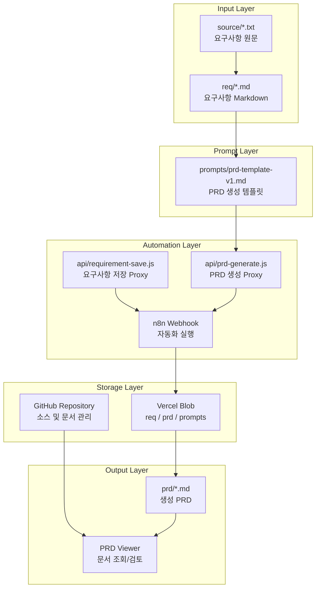
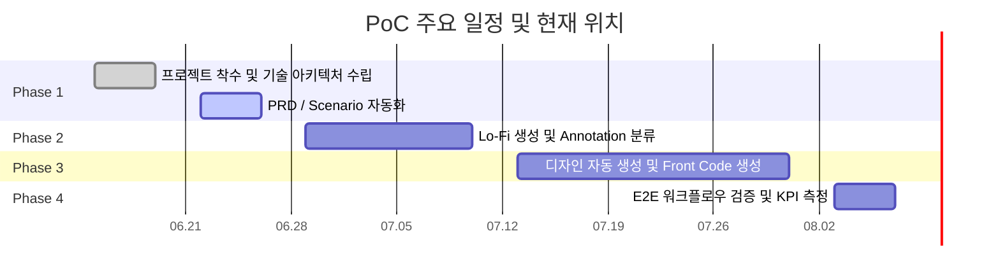
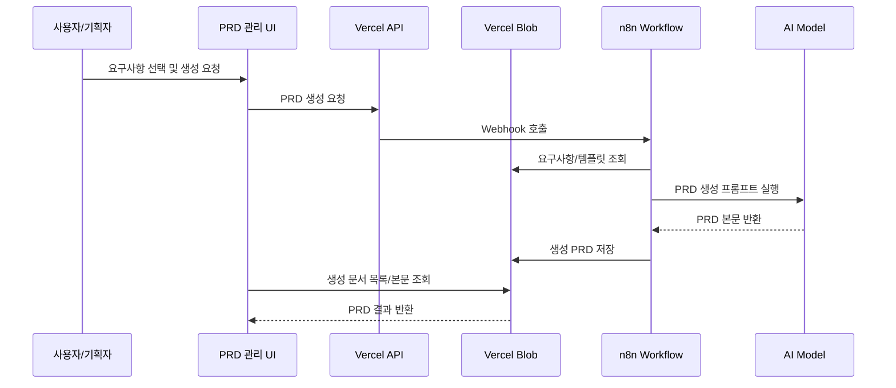
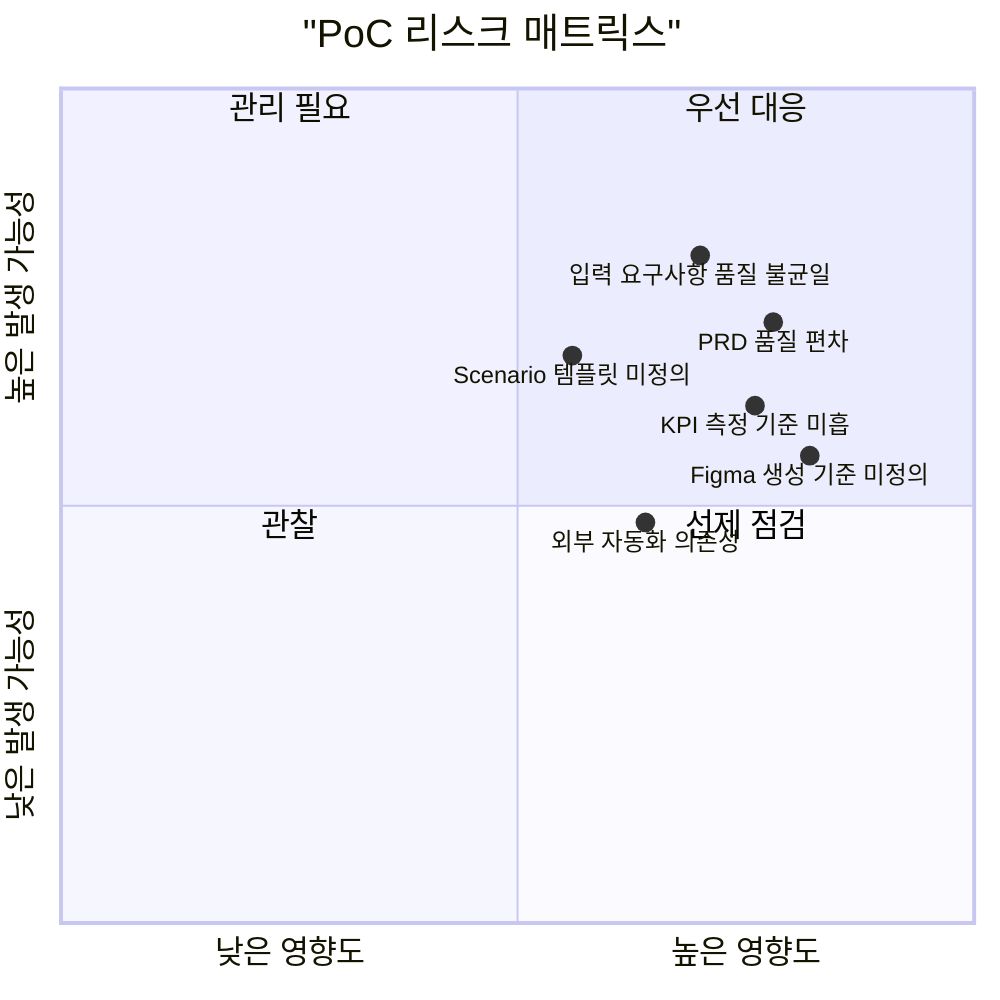

# AX 기반 Design-to-Code 자동화 PoC 진행 보고서

- 보고일: 2026.06.22
- 작성 기준일: 2026.06.21
- 작성자: HOWARD.CHOI
- 프로젝트: AX 기반 Design-to-Code 자동화 PoC

## 1. Executive Summary

본 PoC는 기획, 디자인, 프론트엔드 개발로 이어지는 기존 업무 흐름을 AX 기반으로 재설계하여 반복 산출물 작성, 단계 간 커뮤니케이션 비용, 디자인-개발 재구현 비용을 줄이는 것을 목표로 한다.

현재까지는 PoC의 1단계인 기획 자동화 기반 구축을 중심으로 진행되었으며, 요구사항 문서를 표준 입력으로 관리하고 PRD 산출물로 전환하는 기본 워크플로우를 구성했다. 이를 통해 이후 Scenario, IA, Screen List, Lo-Fi, Figma Design, Vue Source Code 생성으로 확장하기 위한 입력 표준화 기반을 마련했다.

작업계획서 기준으로 현재 위치는 1주차 기반 구축을 완료하고, 2주차 기획 산출물 자동화 단계에 진입하는 시점이다.

## 2. 프로젝트 목표 및 현재 위치

### 2.1 PoC 핵심 목표

| 구분 | 핵심 목표 | 현재 진행 상태 |
| --- | --- | --- |
| 기획 자동화 | PRD, Scenario, User Flow 자동 생성 | PRD 자동 생성 기반 구축, Scenario 확장 예정 |
| 디자인 자동화 | IA, 화면 목록, Lo-Fi, Figma Design 생성 | 후속 단계 준비 중 |
| 코드 자동화 | Vue3, TypeScript, Pinia 기반 Front Code 생성 | 후속 단계 준비 중 |
| E2E 검증 | Google Docs/요구사항에서 최종 코드까지 연결 | 1차 입력-PRD 구간 구축 |

### 2.2 전체 가치 흐름

## 3. 금일까지 진행된 주요 내용

### 3.1 구축 완료 항목

| 영역 | 진행 내용 | 산출물 |
| --- | --- | --- |
| 요구사항 관리 | 요구사항 원문과 Markdown 변환 파일 관리 구조 구성 | `req`, `source` |
| PRD 템플릿 | 글로벌 B2C 기준 PRD 생성 프롬프트 정의 | `prompts/prd-template-v1.md` |
| PRD 생성 결과 | 샘플 요구사항 기반 PRD 문서 생성 | `prd` |
| 저장소 연동 | Vercel Blob 기반 파일 목록/본문 조회 및 저장 구조 구성 | Blob API |
| 자동화 연동 | n8n Webhook을 통한 요구사항 저장 및 PRD 생성 요청 구조 구성 | Webhook Proxy API |
| 관리 UI | 요구사항 선택, 템플릿 선택, PRD 목록/본문 확인 화면 구성 | `prd.html`, `asset` |
| 운영 기준 | ID/Class 네이밍 규칙 정리 | `docs/id_class_naming_rule.md` |

### 3.2 현재 산출물 현황

| 산출물 구분 | 수량 | 설명 |
| --- | ---: | --- |
| 요구사항 Markdown | 5건 | 쿠폰 관리자, 약국 정보 B2C, 과자공자 안내 서비스 등 |
| 요구사항 원문 | 5건 | 요구사항 원본 텍스트 보관 |
| 생성 PRD | 2건 | 쿠폰 관리자 요구사항 기반 생성 결과 |
| PRD 템플릿 | 1건 | AI-Native PRD Generation Prompt v1.3 |
| API | 9개 | Blob, GitHub, n8n 연동용 API |
| 화면 자산 | 2개 | UI Script, Stylesheet |
| 운영 문서 | 1건 | 네이밍 규칙 |

### 3.3 산출물 구성도

## 4. 작업계획서 대비 진행률

### 4.1 Phase 기준 진행 현황

| Phase | 계획 내용 | 주요 산출물 | 현재 상태 |
| --- | --- | --- | --- |
| Phase 1 | 기획 자동화, PRD/Scenario 템플릿 정의, 프롬프트 설계 | PRD.md, Scenario.md | PRD 기반 구축 완료, Scenario 예정 |
| Phase 2 | Design Image Annotation, Lo-Fi, IA, Screen List, Figma Design | Lo-Fi Wireframe, Figma Design | 준비 단계 |
| Phase 3 | Design-to-Code, MCP 및 Cursor 연계, Page/Component/Store 생성 | Vue Source Code | 미착수 |
| Phase 4 | E2E 검증, KPI 측정, 리포트 작성 | TC, Reports | 미착수 |

### 4.2 일정 기준 현재 위치

> 참고: 작업계획서 원문에는 5~7주차 일정이 `06.15 ~ 07.31`로 표기되어 있으나, 전체 일정 흐름상 `07.13 ~ 07.31`로 해석하는 것이 자연스럽다. 공식 보고 시 일정 표기는 확인 후 정정이 필요하다.

## 5. 현재 아키텍처 요약

### 5.1 구성 요소

| Layer | 구성 요소 | 역할 |
| --- | --- | --- |
| Front UI | PRD 생성 도우미 | 요구사항 선택, 템플릿 선택, 생성 문서 조회 |
| Storage | Vercel Blob | 요구사항, 프롬프트, 생성 PRD 저장 |
| Automation | n8n | 요구사항 저장 및 PRD 생성 자동화 실행 |
| API | Vercel Serverless API | UI와 Blob/n8n 간 Proxy |
| Repository | GitHub / Local Repo | 소스, 문서, 산출물 버전 관리 |

### 5.2 시스템 흐름

## 6. KPI 기준과 측정 계획

작업계획서의 KPI는 자동 생성 성공률과 시간 절감률을 중심으로 구성되어 있다. 현재 단계에서는 PRD 자동화 측정 체계를 먼저 정의하고, 이후 Design/Code Generation 단계로 확장한다.

### 6.1 KPI 매핑

| KPI 구분 | 목표 | 현재 측정 가능 상태 | 다음 액션 |
| --- | ---: | --- | --- |
| PRD 및 시나리오 자동 생성 성공률 | 60% 이상 | PRD 생성 결과 수집 가능 | 성공/실패 판정 기준 정의 |
| PRD 작성 시간 절감 | 30% 이상 | 생성 요청 시점과 결과 확인 가능 | AS-IS 수작업 시간 기준 확보 |
| Lo-Fi 생성 시간 단축 | 50% | 미착수 | IA/Screen List 입력 구조 정의 |
| 디자인 주요 화면 자동 생성율 | 70% | 미착수 | Figma 생성 기준 정의 |
| 프론트 코드 자동 생성율 | 70% | 미착수 | Vue Component/Page/Store 산출 기준 정의 |

### 6.2 예상 절감 효과 기준

```mermaid
xychart-beta
    title "AS-IS / TO-BE 예상 작업 시간 비교"
    x-axis ["PRD", "Lo-Fi", "Hi-Fi", "Front Code"]
    y-axis "Hours" 0 --> 24
    bar "AS-IS" [8, 6, 12, 24]
    bar "TO-BE" [3, 2, 4, 8]
```

| 항목 | 기존 방식 | 적용 후 목표 | 예상 절감률 |
| --- | ---: | ---: | ---: |
| PRD 작성 | 8h | 3h | 62.5% |
| Lo-Fi Wireframe | 6h | 2h | 66.7% |
| Hi-Fi Design | 12h | 4h | 66.7% |
| Front Publishing Code | 24h | 8h | 66.7% |

## 7. 주요 성과

### 7.1 정량 성과

| 항목 | 성과 |
| --- | ---: |
| 요구사항 샘플 확보 | 5건 |
| PRD 생성 결과 확보 | 2건 |
| PRD 템플릿 버전 | 1.3 |
| 자동화 API 구성 | 9개 |
| 관리 UI 주요 컬럼 | 3개 |

### 7.2 정성 성과

- 요구사항 입력부터 PRD 결과 확인까지의 기본 자동화 흐름을 업무 화면으로 구성했다.
- 요구사항, 프롬프트, 생성 결과를 파일 단위로 분리하여 재사용 가능한 구조를 만들었다.
- PRD 생성 템플릿에 KPI, Legal, Accessibility, Platform, Performance, Security 등 실무 검토 항목을 포함해 산출물 품질 기준을 높였다.
- 후속 단계인 Scenario, IA, Design, Code Generation으로 확장 가능한 입력 구조를 확보했다.

## 8. 리스크 및 대응 방안

| 리스크 | 영향 | 대응 방향 |
| --- | --- | --- |
| 입력 요구사항 품질 차이 | 생성 PRD 품질 편차 발생 | 요구사항 입력 템플릿과 필수 항목 정의 |
| PRD 성공 기준 미정의 | 자동 생성 성공률 측정 어려움 | 품질 체크리스트 및 Pass/Fail 기준 수립 |
| Scenario 템플릿 미정의 | Phase 1 완료 판단 지연 | Scenario 산출물 구조 우선 정의 |
| Figma/Lo-Fi 입력 구조 미흡 | Phase 2 전환 지연 | PRD에서 IA/Screen List로 변환되는 필드 정의 |
| 자동화 외부 의존성 | n8n/Blob 환경 이슈 시 흐름 중단 | 장애 로그, 재시도, 수동 백업 경로 마련 |

## 9. 다음 주 추진 계획

### 9.1 우선순위

| 우선순위 | 작업 | 목적 |
| --- | --- | --- |
| P0 | PRD 생성 품질 기준 정의 | KPI 측정 가능 상태 확보 |
| P0 | Scenario 템플릿 작성 | Phase 1 산출물 완성 |
| P1 | 요구사항 입력 표준 보강 | 생성 품질 안정화 |
| P1 | PRD -> IA/Screen List 변환 구조 설계 | Phase 2 전환 준비 |
| P2 | 로그/결과 측정 항목 정리 | 리포트 자동화 기반 마련 |

### 9.2 다음 단계 흐름

```mermaid
flowchart LR
    A["PRD 생성 품질 기준"] --> B["Scenario Template"]
    B --> C["User Flow"]
    C --> D["IA / Screen List"]
    D --> E["Lo-Fi Wireframe"]
    E --> F["Figma Design"]
    F --> G["Vue Code Generation"]

    A:::now
    B:::now
    C:::next
    D:::next
    E:::later
    F:::later
    G:::later

    classDef now fill:#dbeafe,stroke:#2563eb,color:#111827,stroke-width:2px;
    classDef next fill:#ecfdf5,stroke:#10b981,color:#111827;
    classDef later fill:#f8fafc,stroke:#94a3b8,color:#334155;
```

## 10. 보고 결론

현재 PoC는 계획상 2주차 진입 시점에 맞춰 기획 산출물 자동화의 기본 기반을 확보한 상태다. 요구사항을 표준 입력으로 관리하고, PRD 템플릿과 자동화 흐름을 연결했으며, 생성 결과를 업무 화면에서 확인할 수 있는 구조까지 구성했다.

다음 단계에서는 PRD 자동화의 품질 기준을 먼저 확정하고 Scenario 자동 생성까지 확장해야 한다. 이후 IA, Screen List, Lo-Fi로 이어지는 디자인 입력 구조를 정의하면 작업계획서의 핵심 우선순위인 Design Generation과 Code Generation 단계로 자연스럽게 전환할 수 있다.

최종적으로는 단순 문서 자동화가 아니라, 기획 산출물을 디자인 및 프론트 코드 생성의 표준 입력으로 활용하는 E2E AX 워크플로우 검증이 본 PoC의 핵심 성과가 될 것이다.
